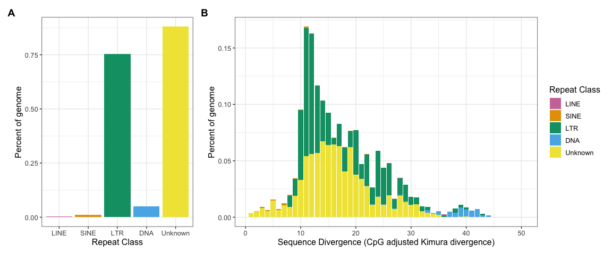
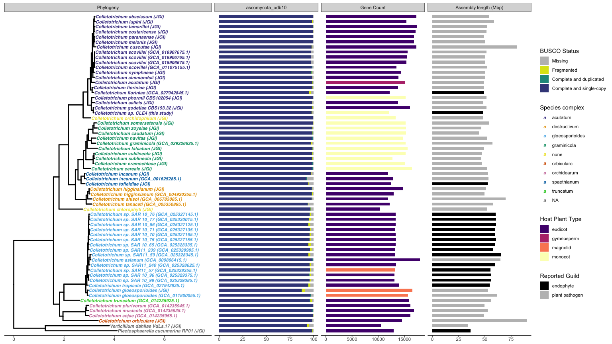
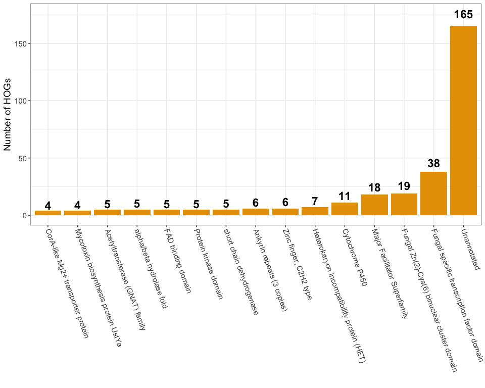
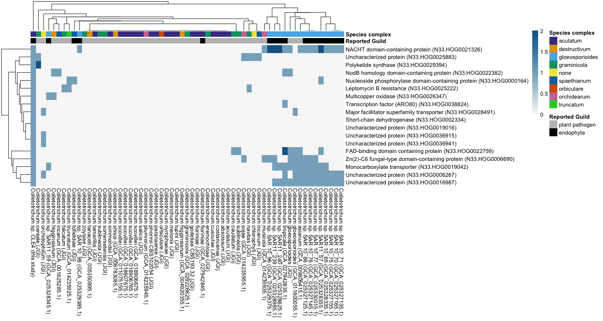
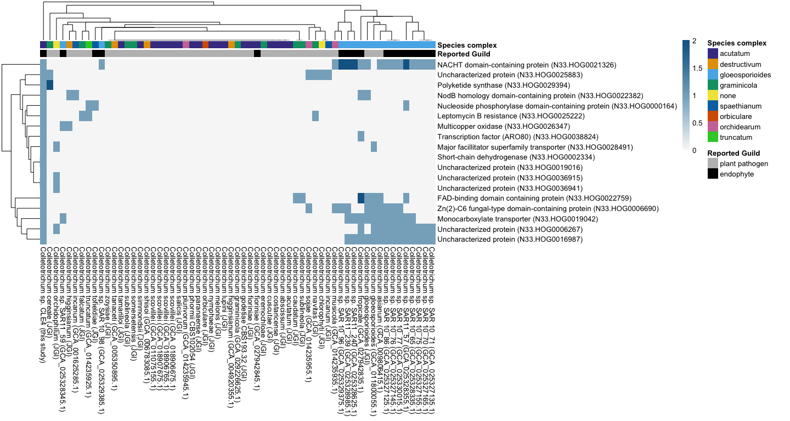
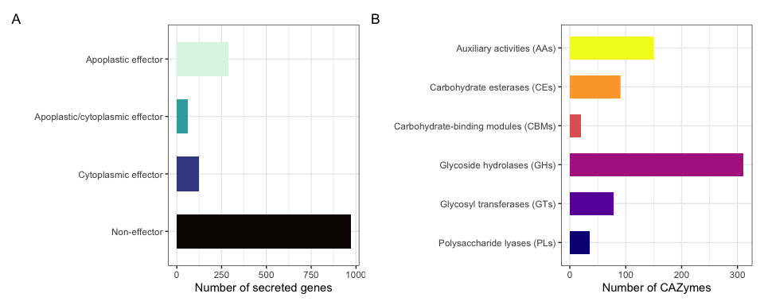

Genomic analysis of seagrass-associated Colletotrichum sp. CLE4
================
Cassie Ettinger

``` r
# Load libraries
library(tidyverse)
library(ggtree)
library(treeio)
library(ggplot2)
library(ape)
library(patchwork)
library(ggnewscale)
library(vroom)
library(RColorBrewer)
library(viridis)
library(ggplotify)
library(pheatmap)
library(UpSetR)
```

## Figure 1: Repeat landscape

``` r
# Import genome info and tip names
OG.meta <- vroom("../data/SGColleto_metadata.csv")

# Import repeat results
repeat.land.class <- vroom("../data/repeatmasker/Colletotrichum.sorted.fasta.out.landscape.Div.Rclass.fix.tab",
    skip = 1)

# Transpose
repeat.land.class.t <- t(repeat.land.class)

# Get rid of first row
repeat.land.class.t2 <- repeat.land.class.t[-c(1), ]

# Add column names for graphing
colnames(repeat.land.class.t2) <- repeat.land.class.t[1, ]

# Convert to tibble
repeat.land.class.t3 <- as.tibble(repeat.land.class.t2)
```

    ## Warning: `as.tibble()` was deprecated in tibble 2.0.0.
    ## ℹ Please use `as_tibble()` instead.
    ## ℹ The signature and semantics have changed, see `?as_tibble`.
    ## This warning is displayed once every 8 hours.
    ## Call `lifecycle::last_lifecycle_warnings()` to see where this warning was
    ## generated.

``` r
# Add column with bin divergences
repeat.land.class.t3$DivBin <- 1:50

# Total genome size used for repeatmasker
total = (OG.meta %>%
    filter(Accession == "Seagrass"))$`Assembly Length`

# Get % genome for each bin use str_trim to get rid of
# whitespace Had to change from str -> numeric to do math
repeat.land.class.t4 <- repeat.land.class.t3 %>%
    mutate(per_DNA = (as.numeric(str_trim(DNA))/total) * 100,
        per_Unk = (as.numeric(str_trim(Unknown))/total) * 100,
        per_SINE = (as.numeric(str_trim(`SINE?`))/total) * 100,
        per_LINE = (as.numeric(str_trim(LINE))/total) * 100,
        per_LTR = (as.numeric(str_trim(LTR))/total) * 100)


# Gather up percentages for plotting by divergence bin
repeat.land.class.t4 <- repeat.land.class.t4 %>%
    group_by(DivBin) %>%
    gather(key = "repeat_class", value = "percent_genome", per_DNA,
        per_Unk, per_SINE, per_LINE, per_LTR)

# Covert to factor for plotting
repeat.land.class.t4$repeat_class <- factor(repeat.land.class.t4$repeat_class,
    levels = c("per_LINE", "per_SINE", "per_LTR", "per_DNA",
        "per_Unk"))

# Abbreviations: DNA = DNA transposon; LINE = long
# interspersed nuclear element; LTR = long terminal repeat
# retrotransposon; RC = rolling circle transposons
# (Helitron); SINE = small interspersed nuclear element.
kimplot <- ggplot(data = repeat.land.class.t4, aes(x = DivBin,
    y = percent_genome, fill = repeat_class)) + geom_bar(position = "stack",
    stat = "identity") + theme_bw() + theme(text = element_text(size = 12)) +
    # theme(panel.background = element_blank()) +
xlab("Sequence Divergence (CpG adjusted Kimura divergence)") +
    ylab("Percent of genome") + scale_fill_manual(labels = c(per_DNA = "DNA",
    per_Unk = "Unknown", per_SINE = "SINE", per_LINE = "LINE",
    per_LTR = "LTR"), values = c("#CC79A7", "#E69F00", "#009E73",
    "#56B4E9", "#F0E442")) + guides(fill = guide_legend(title = "Repeat Class"))


# Now summarize for total percentages of each repeat class
repeat.land.class.t5 <- repeat.land.class.t4 %>%
    group_by(repeat_class) %>%
    summarise(total_per = sum(percent_genome))

# Make factor for plotting
repeat.land.class.t5$repeat_class <- factor(repeat.land.class.t5$repeat_class,
    labels = c("LINE", "SINE", "LTR", "DNA", "Unknown"))

# Plot class x total percent of genome
totplot <- ggplot(data = repeat.land.class.t5, aes(x = repeat_class,
    y = total_per, fill = repeat_class)) + geom_bar(position = "stack",
    stat = "identity") + theme_bw() + theme(text = element_text(size = 12)) +
    xlab("Repeat Class") + ylab("Percent of genome") + scale_fill_manual(labels = c(per_DNA = "DNA",
    per_Unk = "Unknown", per_SINE = "SINE", per_LINE = "LINE",
    per_LTR = "LTR"), values = c("#CC79A7", "#E69F00", "#009E73",
    "#56B4E9", "#F0E442")) + guides(fill = guide_legend(title = "Repeat Class"))

# Combine plots
totplot + kimplot + plot_annotation(tag_levels = "A") + plot_layout(guides = "collect",
    widths = c(1, 2)) & theme(plot.tag = element_text(face = "bold"))
```

<!-- -->

``` r
ggsave(filename = "../plots/figure1cd.png", plot = last_plot(),
    device = "png", width = 12, height = 5, dpi = 300)
ggsave(filename = "../plots/figure1cd.pdf", plot = last_plot(),
    device = "pdf", width = 12, height = 5, dpi = 300)
```

## Figure 2: Phylogenic analysis and visualization

``` r
# Import tree from phyling
coll_tre <- read.newick("../data/phyling/SGColleto.110.fungi_odb10.contree.rooted.tre")

# Re-scale branch lengths for visability
coll_tre$edge.length <- coll_tre$edge.length * 10

# Subset the tree to only group of interest
complex_sub_tre = tree_subset(coll_tre, "Seagrass", levels_back = 8)

# Get taxa from each tip in the subset tree
complex_sub_tre_taxa <- complex_sub_tre$tip.label

# Now subset metadata
complex_sub_tre_taxa_meta <- OG.meta %>%
    filter(Accession %in% complex_sub_tre_taxa) %>%
    select(Accession, complex, PhyloName)

OG.meta.sub <- OG.meta %>%
    filter(Accession %in% complex_sub_tre_taxa) %>%
    select(Accession, everything())

# Reshape BUSCO scores for plotting
OG.meta.sub.busco <- OG.meta.sub %>%
    select(Accession, Single, Duplicated, Fragmented, Missing) %>%
    pivot_longer(Single:Missing)

# Re-level BUSCO for plotting
OG.meta.sub.busco$name <- factor(OG.meta.sub.busco$name, levels = c("Missing",
    "Fragmented", "Duplicated", "Single"))

# Join subset metadata with the subset tree
complex_sub_named_tree <- full_join(complex_sub_tre, complex_sub_tre_taxa_meta,
    by = c(label = "Accession"))

# Plot tree
phylo.sub.tre <- ggtree(complex_sub_named_tree, color = "black",
    size = 1, linetype = 1) + geom_tiplab(aes(label = PhyloName,
    color = complex), fontface = "bold.italic", size = 3, offset = 1e-04) +
    guides(color = guide_legend(title = "Species complex")) +
    scale_color_manual(values = c("#473D92", "#E69F00", "#56B4E9",
        "#009E73", "#F0E442", "#D55E00", "#CC79A7", "#0072B2",
        "limegreen"))


# Add bar plots for BUSCO, etc
tree_plus <- phylo.sub.tre + theme(axis.title.x = element_text(),
    axis.text.x = element_text(), axis.ticks.x = element_line(),
    axis.line.x = element_line()) + geom_facet(panel = "ascomycota_odb10",
    data = OG.meta.sub.busco, geom = geom_bar, aes(x = value,
        fill = name), orientation = "y", stat = "identity", position = "stack",
    width = 0.6) + scale_fill_manual(labels = c(Single = "Complete and single-copy",
    Duplicated = "Complete and duplicated", Fragmented = "Fragmented",
    Missing = "Missing"), values = c("grey", "#DCE318FF", "#1F968BFF",
    "#3F4788FF")) + guides(fill = guide_legend(title = "BUSCO Status")) +
    new_scale_fill() + geom_facet(panel = "Gene Count", data = OG.meta.sub,
    geom = geom_bar, aes(x = `# Genes`, fill = `Plant Type`),
    orientation = "y", stat = "identity", width = 0.6) + scale_fill_viridis_d(option = "magma",
    begin = 0.25, direction = 1) + guides(fill = guide_legend(title = "Host Plant Type")) +
    new_scale_fill() + geom_facet(panel = "Assembly length (Mbp)",
    data = OG.meta.sub, geom = geom_bar, aes(x = `Assembly Length`/1e+06,
        fill = `Reported Guild`), orientation = "y", stat = "identity",
    position = "stack", width = 0.6) + scale_fill_manual(values = c("black",
    "grey")) + xlim_tree(7.5)

# Re-label tree facet
tree_plus <- facet_labeller(tree_plus, c(Tree = "Phylogeny"))

# Re-size facets
facet_widths(tree_plus, widths = c(2, 1, 1, 1))
```

<!-- -->

``` r
ggsave(filename = "../plots/figure2.pdf", plot = last_plot(),
    device = "pdf", width = 16, height = 9, dpi = 300)
ggsave(filename = "../plots/figure2.png", plot = last_plot(),
    device = "png", width = 16, height = 9, dpi = 300)
```

``` r
# Average number of genes and genome size in C. acutatum
# complex (excluding CLE4)
mean((OG.meta.sub %>%
    filter(complex == "acutatum" & Accession != "Seagrass"))$`# Genes`)
```

    ## [1] 15383.42

``` r
mean((OG.meta.sub %>%
    filter(complex == "acutatum" & Accession != "Seagrass"))$`Assembly Length`)
```

    ## [1] 52595440

``` r
# Number of genes and genome size in CLE4
(OG.meta.sub %>%
    filter(Accession == "Seagrass"))$`# Genes`
```

    ## [1] 12015

``` r
(OG.meta.sub %>%
    filter(Accession == "Seagrass"))$`Assembly Length`
```

    ## [1] 48026924

``` r
# Number of genes and genome size in closest relative in
# tree
(OG.meta.sub %>%
    filter(Accession == "Colgo1"))$`# Genes`
```

    ## [1] 16071

``` r
(OG.meta.sub %>%
    filter(Accession == "Colgo1"))$`Assembly Length`
```

    ## [1] 51652851

``` r
# Number of genes and genome size in other endophyte in
# complex
(OG.meta.sub %>%
    filter(Accession == "Colfi1"))$`# Genes`
```

    ## [1] 13759

``` r
(OG.meta.sub %>%
    filter(Accession == "Colfi1"))$`Assembly Length`
```

    ## [1] 49002765

## Figure 3A: Orthogroup comparison

``` r
# Import orthofinder results
N33 <- vroom("../data/orthofinder/Phylogenetic_Hierarchical_Orthogroups/N33.GeneCount.tsv")  #Colletotrichum group only 
counts <- vroom("../data/orthofinder/Orthogroups/Orthogroups.GeneCount.tsv")
duplications <- vroom("../data/orthofinder/Gene_Duplication_Events/Duplications.tsv")
dup_sum <- vroom("../data/orthofinder/Comparative_Genomics_Statistics/Duplications_per_Species_Tree_Node.tsv")
ortho_sum <- vroom("../data/orthofinder/Comparative_Genomics_Statistics/OrthologuesStats_Totals.tsv")
ortho_overlap <- vroom("../data/orthofinder/Comparative_Genomics_Statistics/Orthogroups_SpeciesOverlaps.tsv")
ortho_membership <- vroom("../data/orthofinder/Orthogroups/Orthogroups.tsv")

# Import annotations
annotations <- vroom("../data/funannotate_results/Colletotrichum.annotations.txt")
secret <- vroom("../data/funannotate_results/Colletotrichum_effector3P.txt")

# Get orthogroup IDs for CLE4
sg_genes_in_og <- ortho_membership %>%
    select(Orthogroup, Seagrass.aa) %>%
    filter(!is.na(Seagrass.aa)) %>%
    mutate(Seagrass.aa = str_replace_all(Seagrass.aa, "Seagrass[|]",
        "")) %>%
    separate_longer_delim(Seagrass.aa, delim = ", ")

# Connect EffectorP and Orthogroup IDs to annotation data
annotations_w_effectors <- full_join(annotations, secret, by = c(TranscriptID = "Identifier"))
annotations_w_effectors_and_og <- full_join(annotations_w_effectors,
    sg_genes_in_og, by = c(TranscriptID = "Seagrass.aa"))


# CLE4 has no unique orthogroups
counts %>%
    mutate(Total = rowSums(across(colnames(counts[-c(1, 112)])))) %>%
    select(Orthogroup, Seagrass.aa, Total) %>%
    filter(Seagrass.aa == Total) %>%
    select(-Total) %>%
    left_join(annotations_w_effectors_and_og)
```

    ## # A tibble: 0 × 32
    ## # ℹ 32 variables: Orthogroup <chr>, Seagrass.aa <dbl>, GeneID <chr>,
    ## #   TranscriptID <chr>, Feature <chr>, Contig <chr>, Start <dbl>, Stop <dbl>,
    ## #   Strand <chr>, Name <chr>, Product <chr>, Alias/Synonyms <lgl>,
    ## #   EC_number <chr>, BUSCO <chr>, PFAM <chr>, InterPro <chr>, EggNog <chr>,
    ## #   COG <chr>, GO Terms <chr>, Secreted <chr>, Membrane <chr>, Protease <chr>,
    ## #   CAZyme <chr>, Notes <lgl>, gDNA <chr>, mRNA <chr>, CDS-transcript <chr>,
    ## #   Translation <chr>, Cytoplasmic effector <chr>, Apoplastic effector <chr>, …

``` r
# However, CLE4 has two unique HOGs / 6 genes
N33 %>%
    mutate(Total = rowSums(across(colnames(N33[-c(1, 2, 3)])))) %>%
    select(HOG, OG, Seagrass.aa, Total) %>%
    filter(Seagrass.aa == Total) %>%
    select(-Total) %>%
    left_join(annotations_w_effectors_and_og, by = c(OG = "Orthogroup"))
```

    ## # A tibble: 6 × 33
    ##   HOG         OG    Seagrass.aa GeneID TranscriptID Feature Contig  Start   Stop
    ##   <chr>       <chr>       <dbl> <chr>  <chr>        <chr>   <chr>   <dbl>  <dbl>
    ## 1 N33.HOG000… OG00…           1 SGCOL… SGCOL_00009… mRNA    scaff… 407986 408270
    ## 2 N33.HOG000… OG00…           1 SGCOL… SGCOL_00298… mRNA    scaff…  21250  22380
    ## 3 N33.HOG000… OG00…           1 SGCOL… SGCOL_00644… mRNA    scaff… 129183 130362
    ## 4 N33.HOG000… OG00…           1 SGCOL… SGCOL_01100… mRNA    scaff… 147851 149027
    ## 5 N33.HOG000… OG00…           1 SGCOL… SGCOL_01102… mRNA    scaff…  62651  63804
    ## 6 N33.HOG001… OG00…           1 SGCOL… SGCOL_00699… mRNA    scaff…  64026  64915
    ## # ℹ 24 more variables: Strand <chr>, Name <chr>, Product <chr>,
    ## #   `Alias/Synonyms` <lgl>, EC_number <chr>, BUSCO <chr>, PFAM <chr>,
    ## #   InterPro <chr>, EggNog <chr>, COG <chr>, `GO Terms` <chr>, Secreted <chr>,
    ## #   Membrane <chr>, Protease <chr>, CAZyme <chr>, Notes <lgl>, gDNA <chr>,
    ## #   mRNA <chr>, `CDS-transcript` <chr>, Translation <chr>,
    ## #   `Cytoplasmic effector` <chr>, `Apoplastic effector` <chr>,
    ## #   `Non-effector` <chr>, Prediction <chr>

``` r
# Subset to remove outgroup
Colletotrichum_only <- N33 %>%
    select(OG.meta$File[OG.meta$Genus == "Colletotrichum"], HOG,
        OG)

Colleto.meta <- OG.meta %>%
    filter(Genus == "Colletotrichum")


# Calculate presence / absence table for plotting and
# collapse across species
og.tots.mean.heat.pa.co <- Colletotrichum_only %>%
    select(HOG, OG, Colleto.meta$File[Colleto.meta$complex ==
        "acutatum"]) %>%
    mutate(Cabscissum = ifelse(Colab1.aa > 0, 1, 0), Cacutatum = ifelse(Colac2.aa >
        0, 1, 0), Ccostaricense = ifelse(Colcu1.aa > 0, 1, 0),
        Ccuscutae = ifelse(Colcu1.aa > 0, 1, 0), Cfiorniniae = ifelse((GCA_027942845.1.aa +
            Colfi1.aa) > 0, 1, 0), Cgodetiae = ifelse(Colgo1.aa >
            0, 1, 0), Clupini = ifelse(Collu1.aa > 0, 1, 0),
        Cmelonis = ifelse(Colme1.aa > 0, 1, 0), Cnymphaeae = ifelse(Colny1.aa >
            0, 1, 0), Cparanaense = ifelse(Colpa1.aa > 0, 1,
            0), Cphormii = ifelse(Colph1.aa > 0, 1, 0), Csalicis = ifelse(Colsa1.aa >
            0, 1, 0), Cscovillei = ifelse((GCA_018906675.1.aa +
            GCA_018906765.1.aa + GCA_018907675.1.aa + GCA_011075155.1.aa) >
            0, 1, 0), Csimmondsii = ifelse(Colsi1.aa > 0, 1,
            0), Seagrass = ifelse(Seagrass.aa > 0, 1, 0), Ctamarilloi = ifelse(Colta1.aa >
            0, 1, 0)) %>%
    mutate(Total = rowSums(across(where(is.numeric)))) %>%
    filter(Total >= 1)

# Select and reorder columns
og.tots.mean.heat.pa.co.sel <- og.tots.mean.heat.pa.co %>%
    select(HOG, OG, Cabscissum, Cacutatum, Ccostaricense, Ccuscutae,
        Cfiorniniae, Cgodetiae, Clupini, Cmelonis, Cnymphaeae,
        Cparanaense, Cphormii, Csalicis, Cscovillei, Csimmondsii,
        Seagrass, Ctamarilloi)

OG.upset.hog <- as.data.frame(og.tots.mean.heat.pa.co.sel)

row.names(OG.upset.hog) <- OG.upset.hog$HOG

OG.upset.hog <- OG.upset.hog[-c(1, 2)]

# Make upset plot per species
upset_plot <- OG.upset.hog %>%
    setNames(c("C.abscissum", "C.acutatum", "C.costaricense",
        "C.cuscutae", "C.fiorniniae", "C.godetiae", "C.lupini",
        "C.melonis", "C.nymphaeae", "C.paranaense", "C.phormii",
        "C.salicis", "C.scovillei", "C.simmondsii", "CLE4", "C.tamarilloi")) %>%
    upset(keep.order = TRUE, order.by = "freq", decreasing = T,
        point.size = 3, line.size = 1.5, text.scale = c(1.4,
            1.2, 1.4, 1.2, 1.75, 1.3), mb.ratio = c(0.6, 0.4),
        main.bar.color = "black", mainbar.y.label = "Shared Hierarchical Orthogroups (HOGs)",
        sets.x.label = "Number of HOGs", intersections = list(list("CLE4"),
            list("C.godetiae"), list("C.salicis"), list("C.phormii"),
            list("C.fiorniniae"), list("C.acutatum"), list("C.simmondsii"),
            list("C.nymphaeae"), list("C.scovillei"), list("C.cuscutae"),
            list("C.melonis"), list("C.paranaense"), list("C.costaricense"),
            list("C.tamarilloi"), list("C.lupini"), list("C.abscissum"),
            list("CLE4", "C.godetiae", "C.salicis", "C.phormii",
                "C.fiorniniae", "C.acutatum", "C.simmondsii",
                "C.nymphaeae", "C.scovillei", "C.cuscutae", "C.melonis",
                "C.paranaense", "C.costaricense", "C.tamarilloi",
                "C.lupini", "C.abscissum"), list("C.godetiae",
                "C.salicis", "C.phormii", "C.fiorniniae", "C.acutatum",
                "C.simmondsii", "C.nymphaeae", "C.scovillei",
                "C.cuscutae", "C.melonis", "C.paranaense", "C.costaricense",
                "C.tamarilloi", "C.lupini", "C.abscissum")),
        queries = list(list(query = intersects, params = list("CLE4"),
            color = "#56B4E9", active = T, query.name = "Colletotrichum sp. CLE4 unique HOGs"),
            list(query = intersects, params = list("CLE4", "C.godetiae",
                "C.salicis", "C.phormii", "C.fiorniniae", "C.acutatum",
                "C.simmondsii", "C.nymphaeae", "C.scovillei",
                "C.abscissum", "C.lupini", "C.costaricense",
                "C.tamarilloi", "C.paranaense", "C.melonis",
                "C.cuscutae"), color = "#473D92", active = T,
                query.name = "C. acutatum complex core HOGs"),
            list(query = intersects, params = list("C.godetiae",
                "C.salicis", "C.phormii", "C.fiorniniae", "C.acutatum",
                "C.simmondsii", "C.nymphaeae", "C.scovillei",
                "C.abscissum", "C.lupini", "C.costaricense",
                "C.tamarilloi", "C.paranaense", "C.melonis",
                "C.cuscutae"), color = "#E69F00", active = T,
                query.name = "Lost C. acutatum complex core HOGs")),
        query.legend = "bottom")

pdf(file = "../plots/figure3a.pdf", width = 12, height = 10)
upset_plot
dev.off()
```

    ## quartz_off_screen 
    ##                 2

## Figure 3B: Lost HOGs

``` r
# What are the lost hogs relative to complex
losthogs <- og.tots.mean.heat.pa.co.sel %>%
    mutate(Total = rowSums(across(where(is.numeric)))) %>%
    filter(Total >= 15) %>%
    filter(Seagrass == 0) %>%
    select(HOG, OG)

# Import and pre-process annotation for orthogroups
all_annot <- vroom("../data/orthofinder/annotation/functional_annotation.txt",
    col_names = c("Gene", "GO", "IPR", "SignalP", "PFAM"), skip = 1)
interpro <- vroom("../data/orthofinder/annotation/interpro_map.tsv")
gomap <- vroom("../data/orthofinder/annotation/interpro_go_terms.txt",
    delim = ";", col_names = c("GO function", "GO"))
pfam_map <- vroom("../data/orthofinder/annotation/Pfam-A.clans.tsv",
    col_names = c("PFAM", "Clan", "ClanID", "Pfam ID", "Pfam description"))

gomap <- gomap %>%
    mutate_at("GO function", str_replace, "GO:", "") %>%
    unique()
```

    ## Warning: There was 1 warning in `mutate()`.
    ## ℹ In argument: `GO function = (function (string, pattern, replacement) ...`.
    ## Caused by warning:
    ## ! One or more parsing issues, call `problems()` on your data frame for details,
    ## e.g.:
    ##   dat <- vroom(...)
    ##   problems(dat)

``` r
ortho_membership_split <- ortho_membership %>%
    pivot_longer(2:111, values_to = "Gene", names_to = "File") %>%
    separate_longer_delim(Gene, delim = ", ")

ortho_annot <- left_join(ortho_membership_split, all_annot) %>%
    mutate_at("IPR", str_replace_all, ":1", "") %>%
    mutate_at("IPR", str_replace_all, ":2", "") %>%
    mutate_at("IPR", str_replace_all, ":3", "") %>%
    mutate_at("IPR", str_replace_all, ":4", "") %>%
    mutate_at("IPR", str_replace_all, ":5", "") %>%
    mutate_at("IPR", str_replace_all, ":6", "") %>%
    mutate_at("IPR", str_replace_all, ":7", "") %>%
    mutate_at("IPR", str_replace_all, ":8", "") %>%
    mutate_at("IPR", str_replace_all, ":9", "") %>%
    separate_longer_delim(IPR, delim = ";")

ortho_annot_go <- left_join(ortho_membership_split, all_annot) %>%
    mutate_at("GO", str_replace_all, ":1", "") %>%
    mutate_at("GO", str_replace_all, ":2", "") %>%
    mutate_at("GO", str_replace_all, ":3", "") %>%
    mutate_at("GO", str_replace_all, ":4", "") %>%
    mutate_at("GO", str_replace_all, ":5", "") %>%
    mutate_at("GO", str_replace_all, ":6", "") %>%
    mutate_at("GO", str_replace_all, ":7", "") %>%
    mutate_at("GO", str_replace_all, ":8", "") %>%
    mutate_at("GO", str_replace_all, ":9", "") %>%
    separate_longer_delim(GO, delim = ";")

ortho_annot_pfam <- left_join(ortho_membership_split, all_annot) %>%
    mutate_at("PFAM", str_replace_all, ":1", "") %>%
    mutate_at("PFAM", str_replace_all, ":2", "") %>%
    mutate_at("PFAM", str_replace_all, ":3", "") %>%
    mutate_at("PFAM", str_replace_all, ":4", "") %>%
    mutate_at("PFAM", str_replace_all, ":5", "") %>%
    mutate_at("PFAM", str_replace_all, ":6", "") %>%
    mutate_at("PFAM", str_replace_all, ":7", "") %>%
    mutate_at("PFAM", str_replace_all, ":8", "") %>%
    mutate_at("PFAM", str_replace_all, ":9", "") %>%
    separate_longer_delim(PFAM, delim = ";")

# Calcluate most frequently seen annotation per orthogroup
most_freq_annot <- ortho_annot %>%
    select(Orthogroup, IPR) %>%
    group_by(Orthogroup) %>%
    filter(!is.na(IPR)) %>%
    count(IPR) %>%
    arrange(desc(n), .by_group = TRUE) %>%
    slice_head(n = 1)

most_freq_annot_pfam <- ortho_annot_pfam %>%
    select(Orthogroup, PFAM) %>%
    group_by(Orthogroup) %>%
    filter(!is.na(PFAM)) %>%
    count(PFAM) %>%
    arrange(desc(n), .by_group = TRUE) %>%
    slice_head(n = 1)

most_freq_annot_go <- ortho_annot_go %>%
    select(Orthogroup, GO) %>%
    group_by(Orthogroup) %>%
    filter(!is.na(GO)) %>%
    count(GO) %>%
    arrange(desc(n), .by_group = TRUE) %>%
    slice_head(n = 1)

# Combine annotations
most_freq_annot_func <- most_freq_annot %>%
    left_join(interpro, by = c(IPR = "ENTRY_AC")) %>%
    select(-n, -ENTRY_TYPE)

# Add in NAs (so that we can get a proper join)
na_losthogs <- losthogs %>%
    filter(!OG %in% most_freq_annot_func$Orthogroup) %>%
    select(OG) %>%
    unique()

losthogs_annot <- most_freq_annot_func %>%
    filter(Orthogroup %in% losthogs$OG) %>%
    full_join(na_losthogs, by = c(Orthogroup = "OG"))

# Repeat for GO terms
most_freq_annot_gofunc <- most_freq_annot_go %>%
    left_join(gomap) %>%
    select(-n)

# Repeat for PFAMs
most_frew_annot_pfamfunc <- most_freq_annot_pfam %>%
    left_join(pfam_map) %>%
    select(-n, -Clan, -ClanID, -`Pfam ID`)

# Combine InterPro, GO and PFAM
losthogs_annot_all <- losthogs_annot %>%
    left_join(most_freq_annot_gofunc) %>%
    left_join(most_frew_annot_pfamfunc)

# Plot lost HOGs
losthogs_annot_all %>%
    ungroup() %>%
    count(`Pfam description`) %>%
    arrange(n) %>%
    mutate(lab_ypos = n + 0.02 * cumsum(n)) %>%
    filter(n >= 4) %>%
    mutate(`Pfam description` = ifelse(is.na(`Pfam description`),
        "Unannotated", as.character(`Pfam description`))) %>%
    mutate(`Pfam description` = fct_reorder(`Pfam description`,
        n, .desc = FALSE)) %>%
    ggplot(aes(x = `Pfam description`, y = n)) + geom_bar(stat = "identity",
    fill = "#E69F00") + theme_bw() + xlab("") + ylab("Number of HOGs") +
    theme(axis.text.x = element_text(angle = -70, hjust = 0,
        vjust = 0.5)) + geom_text(aes(y = lab_ypos, label = n,
    group = `Pfam description`), fontface = "bold", size = 6,
    color = "black") + theme(text = element_text(size = 14))
```

<!-- -->

``` r
ggsave(filename = "../plots/figure3b.pdf", plot = last_plot(),
    device = "pdf", width = 10, height = 8, dpi = 300)
ggsave(filename = "../plots/figure3b.png", plot = last_plot(),
    device = "png", width = 10, height = 8, dpi = 300)
```

## Figure 4: Unique HOGs

``` r
# What are the unique HOGs in CLE4 relative to rest of
# complex
uniquehogs <- og.tots.mean.heat.pa.co.sel %>%
    mutate(Total = rowSums(across(where(is.numeric)))) %>%
    filter(Total >= 1) %>%
    filter(Total == Seagrass) %>%
    select(HOG, OG) %>%
    left_join(annotations_w_effectors_and_og, by = c(OG = "Orthogroup"))

# write_delim(uniquehogs,
# '../results/unique_hogs_vs_cacut.txt', quote = 'none',
# delim='\t')

# Import curated annotation information for these genes
annot.uniq.hogs <- vroom("../data/orthofinder/unique.hog.annotations.txt")


# Return to full dataset and filter to only contain unique
# HOGs
uniquehogs.all <- N33 %>%
    filter(HOG %in% uniquehogs$HOG) %>%
    select(HOG, OG, OG.meta$File[OG.meta$Genus == "Colletotrichum"])

uniquehogs.all <- left_join(uniquehogs.all, annot.uniq.hogs)

# Covert to dataframe for plotting
uniquehogs.all <- as.data.frame(uniquehogs.all)

rownames(uniquehogs.all) <- paste(uniquehogs.all$Function, " (",
    uniquehogs.all$HOG, ")", sep = "")


# Filter and pre-process metadata for plotting
OG.meta.df <- OG.meta %>%
    filter(Genus == "Colletotrichum")

OG.meta.df <- as.data.frame(OG.meta.df)
rownames(OG.meta.df) <- OG.meta.df$File

OG.meta.df.annot <- OG.meta.df %>%
    select(complex, `Reported Guild`)
# select(complex, `Plant Type`, `Reported Guild`)

OG.meta.df.annot$`Species complex` <- OG.meta.df.annot$complex
OG.meta.df.annot <- OG.meta.df.annot %>%
    select(-complex)

# Define annotation colors
ann_colors = list(`Reported Guild` = c(`plant pathogen` = "gray",
    endophyte = "black"), `Species complex` = c(acutatum = "#473D92",
    destructivum = "#E69F00", gloeosporioides = "#56B4E9", graminicola = "#009E73",
    none = "#F0E442", spaethianum = "#0072B2", orbiculare = "#D55E00",
    orchidearum = "#CC79A7", truncatum = "limegreen"))

# Plot heatmap of unique HOGs
ph <- as.ggplot(pheatmap(uniquehogs.all[-c(1, 2, 64, 65, 66)],
    cluster_cols = TRUE, cluster_rows = TRUE, show_rownames = TRUE,
    annotation_col = OG.meta.df.annot, labels_col = OG.meta.df$PhyloName,
    annotation_colors = ann_colors, color = colorRampPalette(c("grey97",
        "#136593"))(50)))
```

<!-- -->

``` r
ph
```

<!-- -->

``` r
ggsave(filename = "../plots/figure4.pdf", plot = last_plot(),
    device = "pdf", width = 15, height = 8, dpi = 300)
ggsave(filename = "../plots/figure4.png", plot = last_plot(),
    device = "png", width = 15, height = 8, dpi = 300)
```

``` r
# Get CLE4 duplications
sg_dup <- duplications %>%
    filter(`Species Tree Node` == "Seagrass.aa")

sg_dup$DuplicationID <- rownames(sg_dup)

# Combine annotation information with duplication
sg_dup_annot <- sg_dup %>%
    pivot_longer(`Genes 1`:`Genes 2`, values_to = "Gene") %>%
    separate_longer_delim(Gene, delim = ", ") %>%
    mutate_at("Gene", str_replace, "Seagrass_aa_Seagrass.|",
        "") %>%
    left_join(annotations_w_effectors_and_og, by = c(Gene = "TranscriptID",
        Orthogroup = "Orthogroup"))

# Number of duplicated orthogroups
length(unique(sg_dup_annot$Orthogroup))
```

    ## [1] 70

``` r
# Number of duplicated genes
length(unique(sg_dup_annot$GeneID))
```

    ## [1] 143

``` r
# Quick look at functions sg_dup_annot %>%
# group_by(InterPro) %>% tally() %>% arrange(desc(n))

# Any effectors?  sg_dup_annot %>% group_by(Prediction) %>%
# tally() %>% arrange(desc(n))
```

## Figure S1: Effectors and CAZYmes

``` r
eff_plot <- annotations_w_effectors_and_og %>%
    mutate(Prediction = ifelse(Prediction == "Cytoplasmic/apoplastic effector",
        "Apoplastic/cytoplasmic effector", as.character(Prediction))) %>%
    filter(!is.na(Prediction)) %>%
    group_by(Prediction) %>%
    tally() %>%
    ggplot(aes(x = Prediction, fill = Prediction, y = n)) + theme_bw() +
    geom_bar(stat = "identity", position = "stack", width = 0.6) +
    coord_flip() + scale_fill_viridis_d(option = "G", direction = -1) +
    ylab("Number of secreted genes") + xlab("") + theme(legend.position = "none") +
    scale_x_discrete(limits = rev)


cazy_plot <- annotations_w_effectors_and_og %>%
    filter(!is.na(CAZyme)) %>%
    mutate(CAZ = ifelse(str_detect(CAZyme, "AA"), "Auxiliary activities (AAs)",
        ifelse(str_detect(CAZyme, "CBM"), "Carbohydrate-binding modules (CBMs)",
            ifelse(str_detect(CAZyme, "CE"), "Carbohydrate esterases (CEs)",
                ifelse(str_detect(CAZyme, "GH"), "Glycoside hydrolases (GHs)",
                  ifelse(str_detect(CAZyme, "GT"), "Glycosyl transferases (GTs)",
                    "Polysaccharide lyases (PLs)")))))) %>%
    group_by(CAZ, CAZyme) %>%
    tally() %>%
    ggplot(aes(x = CAZ, fill = CAZ, y = n)) + theme_bw() + geom_bar(stat = "identity",
    position = "stack", width = 0.6) + coord_flip() + scale_fill_viridis_d(option = "C",
    direction = -1) + ylab("Number of CAZymes") + xlab("") +
    theme(legend.position = "none") + scale_x_discrete(limits = rev)


eff_plot + cazy_plot + plot_annotation(tag_levels = "A")
```

<!-- -->

``` r
ggsave(filename = "../plots/figures1.pdf", plot = last_plot(),
    device = "pdf", width = 10, height = 4, dpi = 300)
ggsave(filename = "../plots/figures1.png", plot = last_plot(),
    device = "png", width = 10, height = 4, dpi = 300)
```

## Figure S2: Orthogroup comparsion across complexes

``` r
# Calculate average orthogroup counts across different
# complexes
OG.tots.counts.mean <- Colletotrichum_only %>%
    mutate(none = rowMeans(across(Colleto.meta$File[Colleto.meta$complex ==
        "none"])), graminicola = rowMeans(across(Colleto.meta$File[Colleto.meta$complex ==
        "graminicola"])), destructivum = rowMeans(across(Colleto.meta$File[Colleto.meta$complex ==
        "destructivum"])), gloeosporioides = rowMeans(across(Colleto.meta$File[Colleto.meta$complex ==
        "gloeosporioides"])), truncatum = rowMeans(across(Colleto.meta$File[Colleto.meta$complex ==
        "truncatum"])), spaethianum = rowMeans(across(Colleto.meta$File[Colleto.meta$complex ==
        "spaethianum"])), orchidearum = rowMeans(across(Colleto.meta$File[Colleto.meta$complex ==
        "orchidearum"])), acutatum = rowMeans(across(Colleto.meta$File[Colleto.meta$complex ==
        "acutatum" & Colleto.meta$File != "Seagrass.aa"])), total = rowSums(across(Colleto.meta$File)),
        orbiculare = rowMeans(across(Colleto.meta$File[Colleto.meta$complex ==
            "orbiculare"])))

# Convert averages to presence / absence table and remove
# orthogroups only present in outgroup taxa
og.tots.mean.heat.pa <- OG.tots.counts.mean %>%
    select(HOG, OG, none, graminicola, destructivum, gloeosporioides,
        truncatum, spaethianum, acutatum, orbiculare, Seagrass.aa) %>%
    mutate(none = ifelse(none > 0, 1, 0), graminicola = ifelse(graminicola >
        0, 1, 0), destructivum = ifelse(destructivum > 0, 1,
        0), gloeosporioides = ifelse(gloeosporioides > 0, 1,
        0), truncatum = ifelse(truncatum > 0, 1, 0), spaethianum = ifelse(spaethianum >
        0, 1, 0), acutatum = ifelse(acutatum > 0, 1, 0), orbiculare = ifelse(orbiculare >
        0, 1, 0), Seagrass.aa = ifelse(Seagrass.aa > 0, 1, 0)) %>%
    mutate(Total = rowSums(across(where(is.numeric)))) %>%
    filter(Total >= 1) %>%
    select(-Total)

# Convert to a dataframe and pre-process for plotting
OG.upset <- as.data.frame(og.tots.mean.heat.pa)

row.names(OG.upset) <- OG.upset$HOG

OG.upset <- OG.upset[-c(1, 2)]

# Make upset plot
upset_plot <- OG.upset %>%
    setNames(c("none", "graminicola", "destructivum", "gloeosporioides",
        "truncatum", "spaethianum", "acutatum", "orbiculare",
        "CLE4")) %>%
    upset(keep.order = TRUE, order.by = "freq", decreasing = T,
        point.size = 3, line.size = 1.5, text.scale = c(1.4,
            1.2, 1.4, 1.2, 1.75, 1.3), mb.ratio = c(0.6, 0.4),
        main.bar.color = "black", mainbar.y.label = "Shared Hierarchical Orthogroups (HOGs)",
        sets.x.label = "Number of HOGs", intersections = list(list("CLE4"),
            list("CLE4", "acutatum", "graminicola", "spaethianum",
                "destructivum", "none", "gloeosporioides", "orbiculare"),
            list("CLE4", "acutatum"), list("CLE4", "graminicola"),
            list("CLE4", "spaethianum"), list("CLE4", "destructivum"),
            list("CLE4", "none"), list("CLE4", "gloeosporioides"),
            list("CLE4", "orbiculare"), list("acutatum", "graminicola",
                "spaethianum", "destructivum", "none", "gloeosporioides",
                "orbiculare")), queries = list(list(query = intersects,
            params = list("CLE4"), color = "#56B4E9", active = T,
            query.name = "Colletotrichum sp. CLE4 unique HOGs"),
            list(query = intersects, params = list("CLE4", "acutatum"),
                color = "#D55E00", active = T, query.name = "C. acutatum complex unique HOGs"),
            list(query = intersects, params = list("acutatum",
                "graminicola", "spaethianum", "destructivum",
                "none", "gloeosporioides", "orbiculare"), color = "#E69F00",
                active = T, query.name = "Lost Colletotrichum spp. core HOGs"),
            list(query = intersects, params = list("CLE4", "acutatum",
                "graminicola", "spaethianum", "destructivum",
                "none", "gloeosporioides", "orbiculare"), color = "#473D92",
                active = T, query.name = "Colletotrichum spp. core HOGs")),
        query.legend = "bottom")


pdf(file = "../plots/sfigure2.pdf", width = 12, height = 10)  # or other device
upset_plot
dev.off()
```

    ## quartz_off_screen 
    ##                 2
